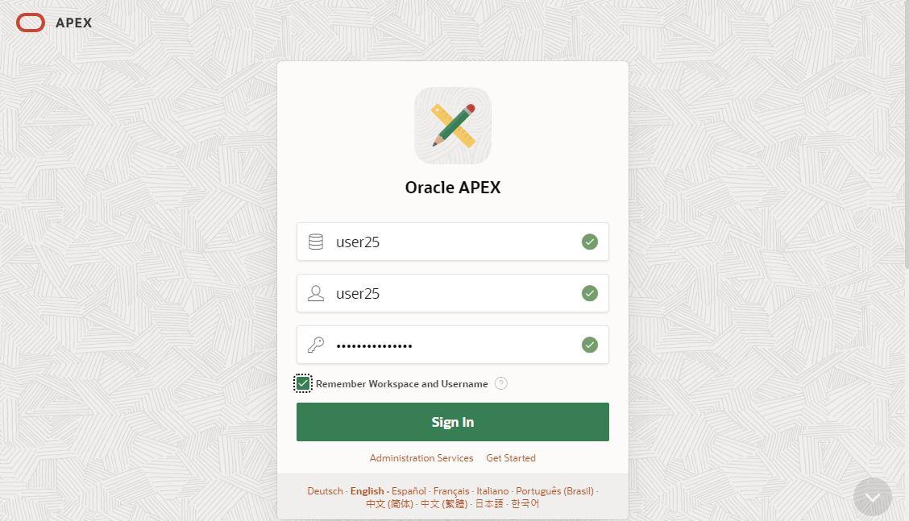
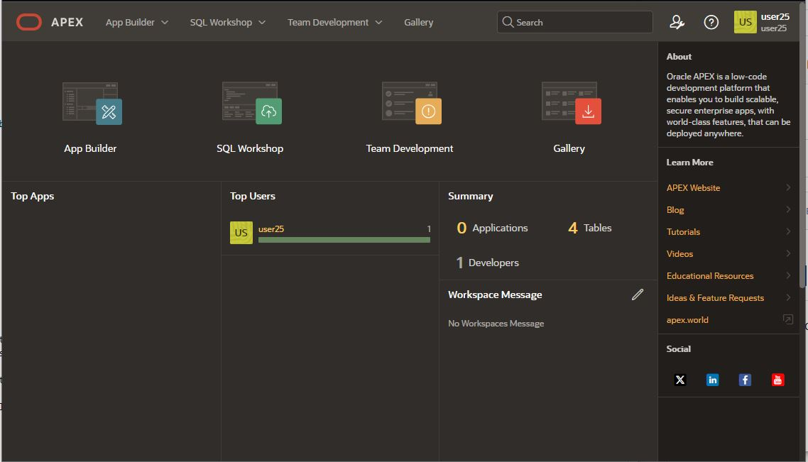

# cegal-ws1502
Material for Cegal workshop 15.02.2024
  
The aim for the workshop is to build a Mobile APEX application that consumes sensor data,
and based on the sensor data applies Machine Learning to create a prediction.
  
The prediction will be visualized in APEX
  
As Sensor we use an Arduino device with micro python that posts sensordata via REST to an autonomous database.
  
The sensor collects data and ingest into a logtable, vs. the APEX application extract the latest log data
and display the predictions.
  
As sample data we will use a set of data collected from a BMW EV from a trip from Oslo to Spain,
that is uploaded into the Autonomous DB, and the appl Oracle DB built in machine learning, ML.
  
For the lab you may either use a python script where the sensordata is manually entered or use the micro python code from the device.
  
### Workshop flow


## Workshop part 1

Create tables and upload trial data  


## Workshop part 2

Apply and test machine learning  

##  Workshop part 3

Add REST services, for adding current speed and current temp, as basis for predictions    

The following API will be added:  

```
POST /wsapi/tempkmh  
POST /wsapi/temp  
POST /wsapi/kmh  
GET /wsapi/tempkmh
GET /wsapi/predict?kmh=xxx&temp=xxx
```


## Workshop part 4

Python Lab  
In this lab the Arduino temp sensor will be used to report current temp to the logdata table  
The Arduino does not have a speed sensor, and the REST API used is /wsapi/temp that supplements the logdata record with the most recent value from the current_speed table.  
During the lab, current_speed may be changed to generate different values in the logdata table  
  
As an alternative to usage of an Arduino, a python script is supplied to interactively update the logtable with the /wsapi/tempkmh API  
  


## Workshop part 5

In this lab you will logon to your apex envrionment and upload an APEX application that displays the predicted power consumption at the current temp/speed.
  
You have a predefined APEX workspace, with the same username/password as your database actions username/password
The URL to the APEX Worksapace is:  

`https://<your ATP instance>.adb.eu-frankfurt-1.oraclecloudapps.com/ords/r/apex/workspace-sign-in/oracle-apex-sign-in?session=106975469353731`

  
  



## Workshop part 6

Simulate or add real sensordata
Run APEX app and visualize prediction  

## Links and supporting documentation

[Arduino developer environment] (https://link-url-here.org)https://codewith.mu/)

  
## Pictures

  

  

  
  The device
  
  

  
  Der Wagen