# Lab 3 instructions, Build ORDS REST API

## Interactive instructions, ORDS creation

Create ORDS module
Navigate to the ORDS screen in dbactions  

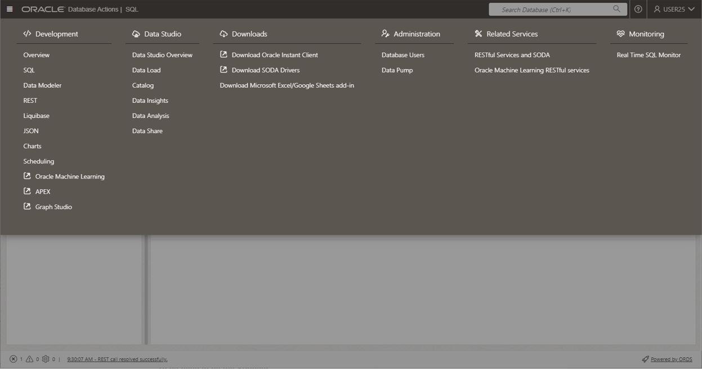

Select modules from top menu  

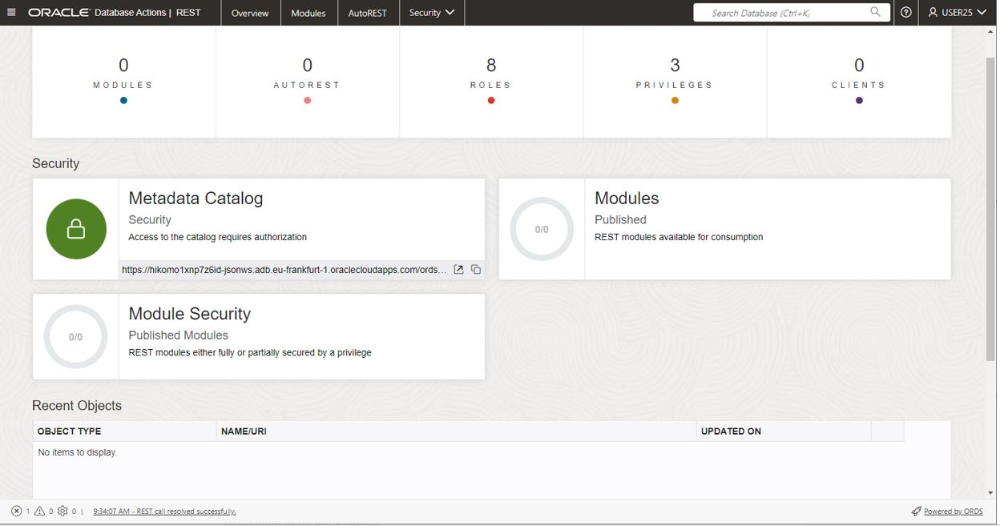
  
Click create module, enter name "workshop", leave the rest, click create  

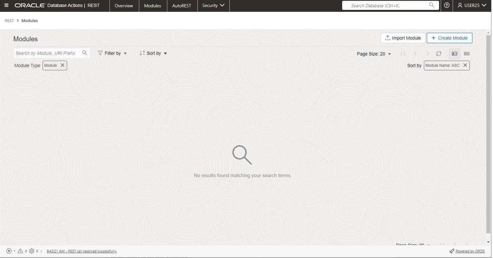

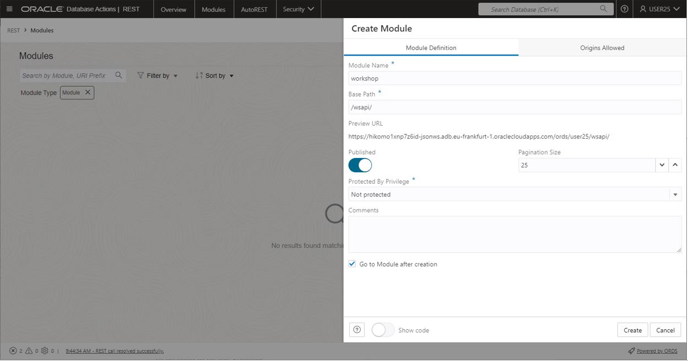
  
Module created, In the workshop title, select create template

You will now create the tempkmh REST API with POST  
Click on "create template"  
Enter Template name "tempkmh", click create  

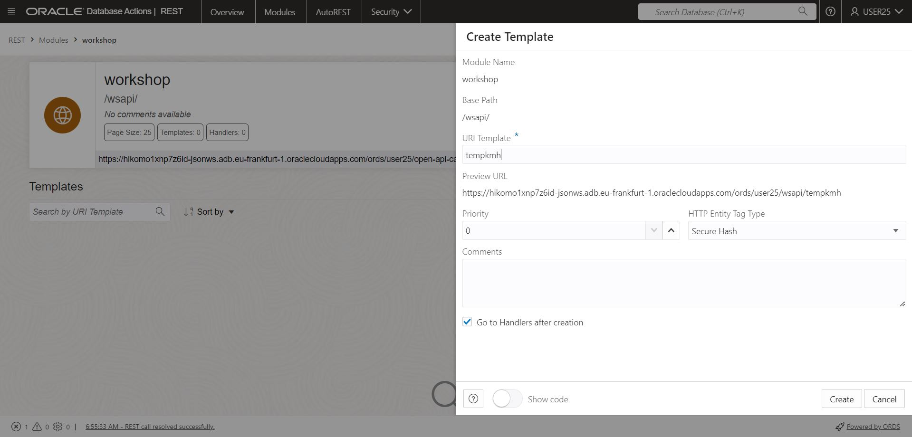
  
Template created, note the Create Handler
Click create handler 

Select POST and add PL/SQL statement: 

`begin insert into logdata (temp,kmh) values(:temp,:kmh); commit; end;`  

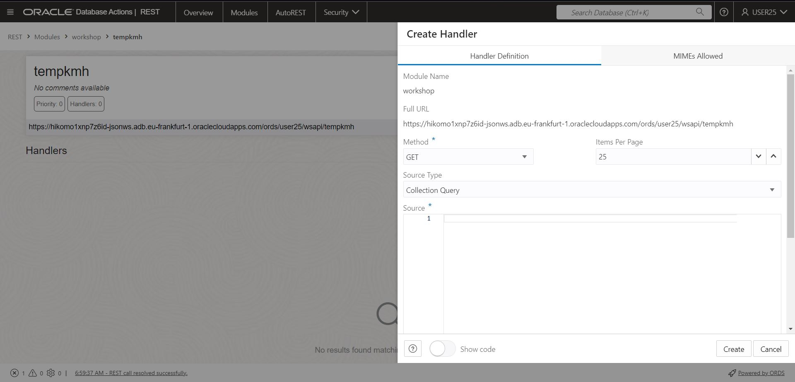

Navigate to MIMEs allowed and select application/json and click add  
  
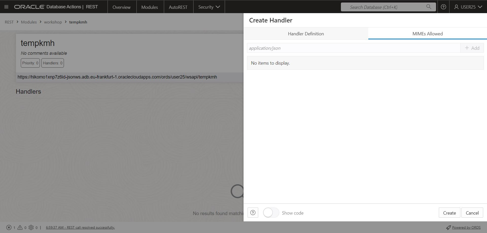

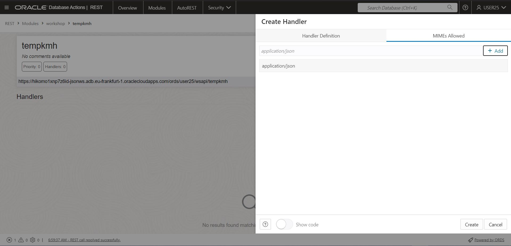

The first REST API handlers is complete

Well done, first API created, navigate back to "workshop"    
  

  
Repeat the steps for creating the temp REST API with POST,but do not add MIMEs allowed.  

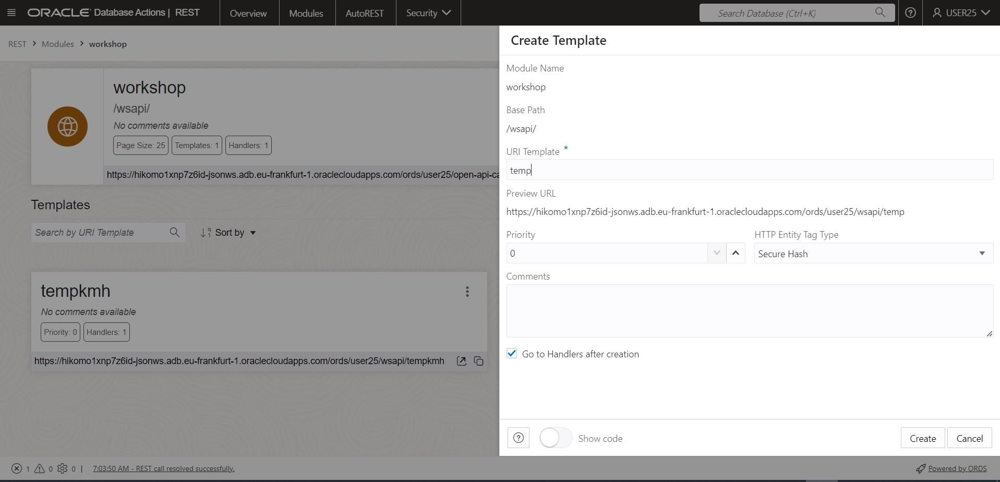

Click create handler  

Enter the PL/SQL below in the handler:  

`begin insert into logdata (temp) values(:temp); commit; end;` 

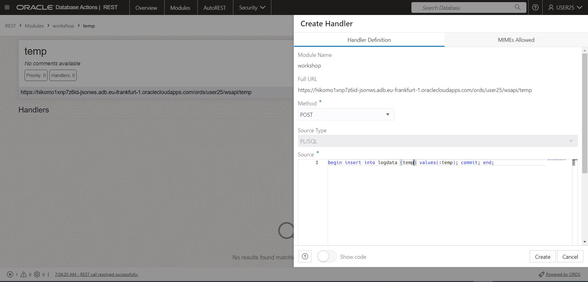  

The micropython implementation does not support setting header variables like "Content Type", and the REST API need
to discard lack of MIME type. Skip setting of MIMEs allowed for this API

The REST API temp is added. 

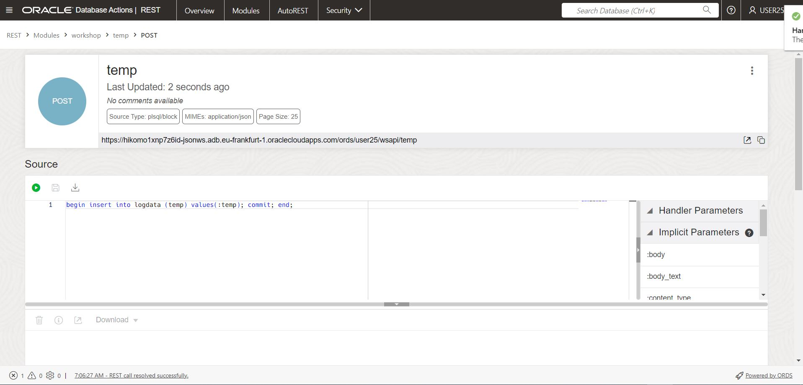

 Repeat the steps and add REST API km, click create template

  

Create tenplate kmh  

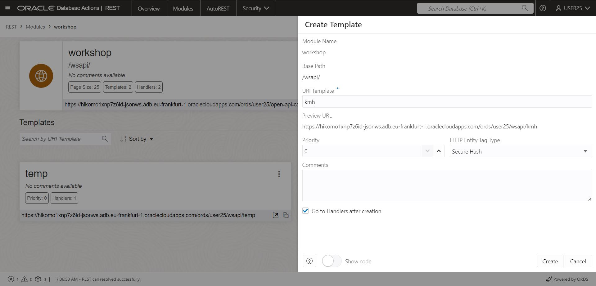

Create the POST handler for kmh

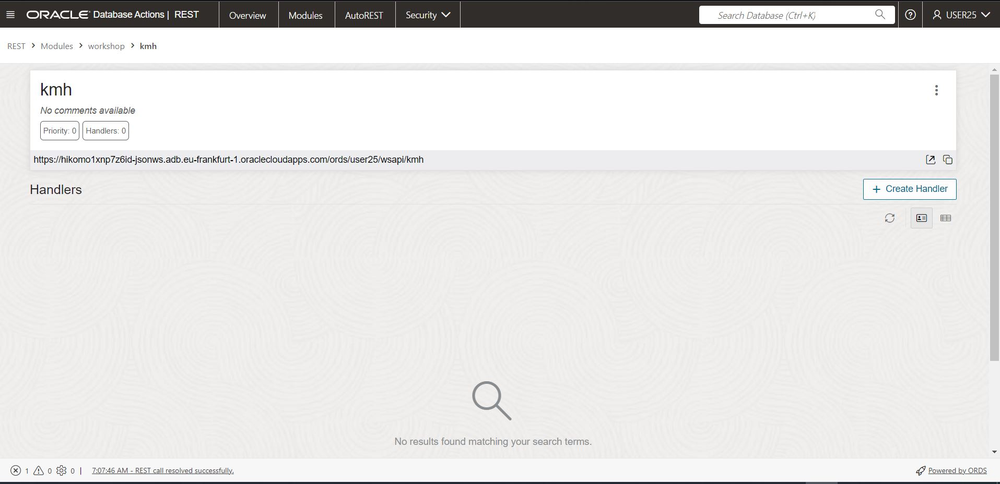

Add the following PL/SQL in the POST handler:  
`begin insert into current_speed (kmh) values(:kmh); commit; end;` 

The REST API kmh is complete  

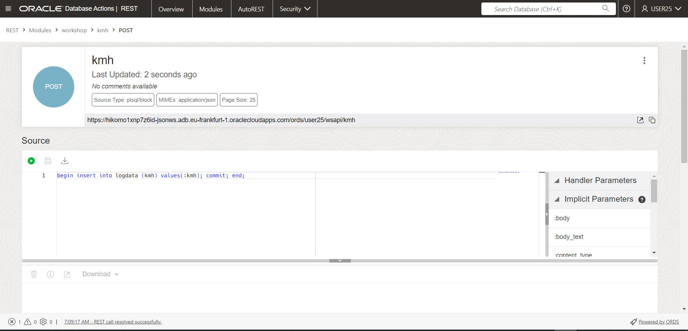

The last REST API, preditct GET deviates a bit.  
This REST API select ad value with a PL/SQL having two input query parameters  

Repeat the steps and add REST API predict, GET. 
Create tempplate predict  
  
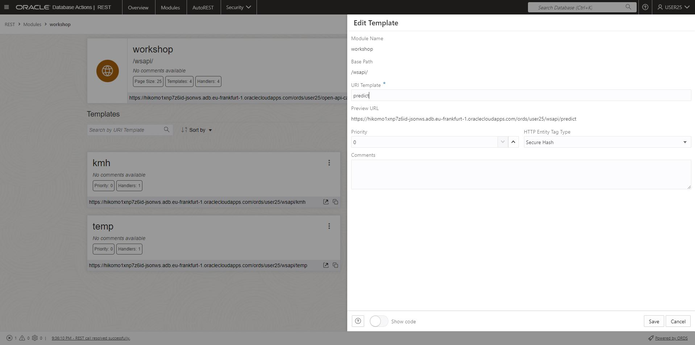

Add the handler for GET  

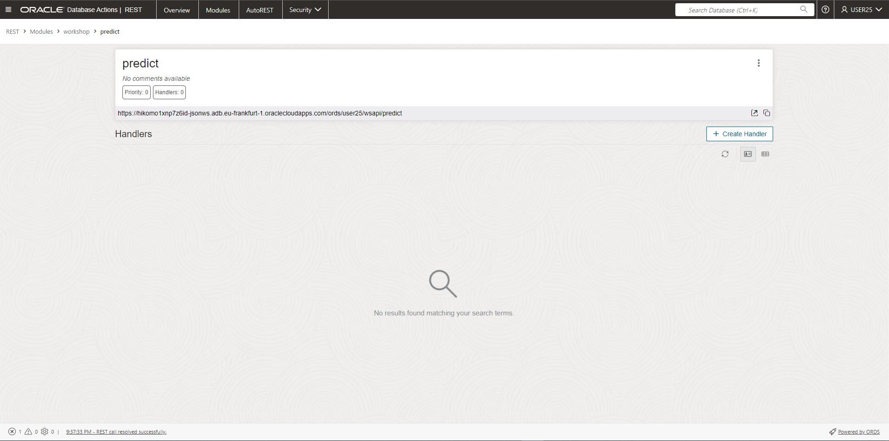
  
Select Source type PL/SQL and add the following PL/SQL in the GET handler:  
   
`begin :p_result:=predict_consumption(:p_kmh,:p_temp); end;` 

Add MIMEs Allowed  

For PL/SQL type GTE we need to define the result data that will be in the JSON response.
We define a response value name "response" as a OUT parameter with the PL/SQL variable p_result as bind variable  
Clict create parameter  

The GET REST API needs to define the return value from the PL/SQL function as a parameter  
Create the parameter:  

And the REST API GET predict is complete

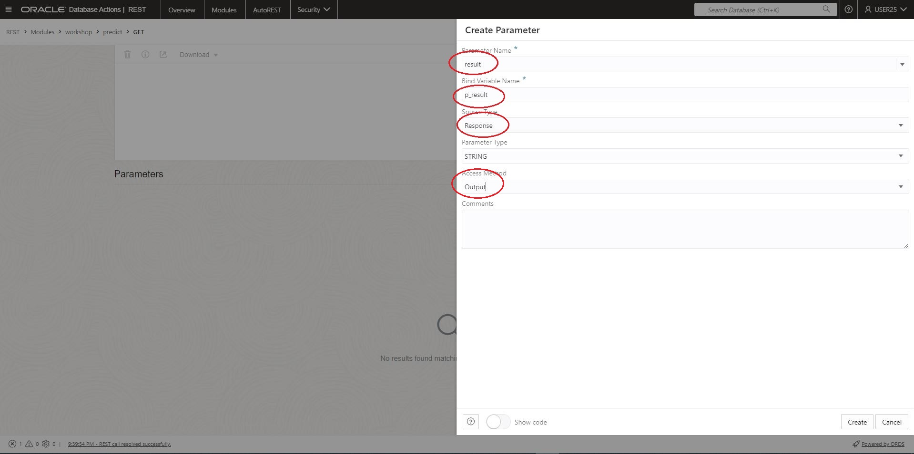

